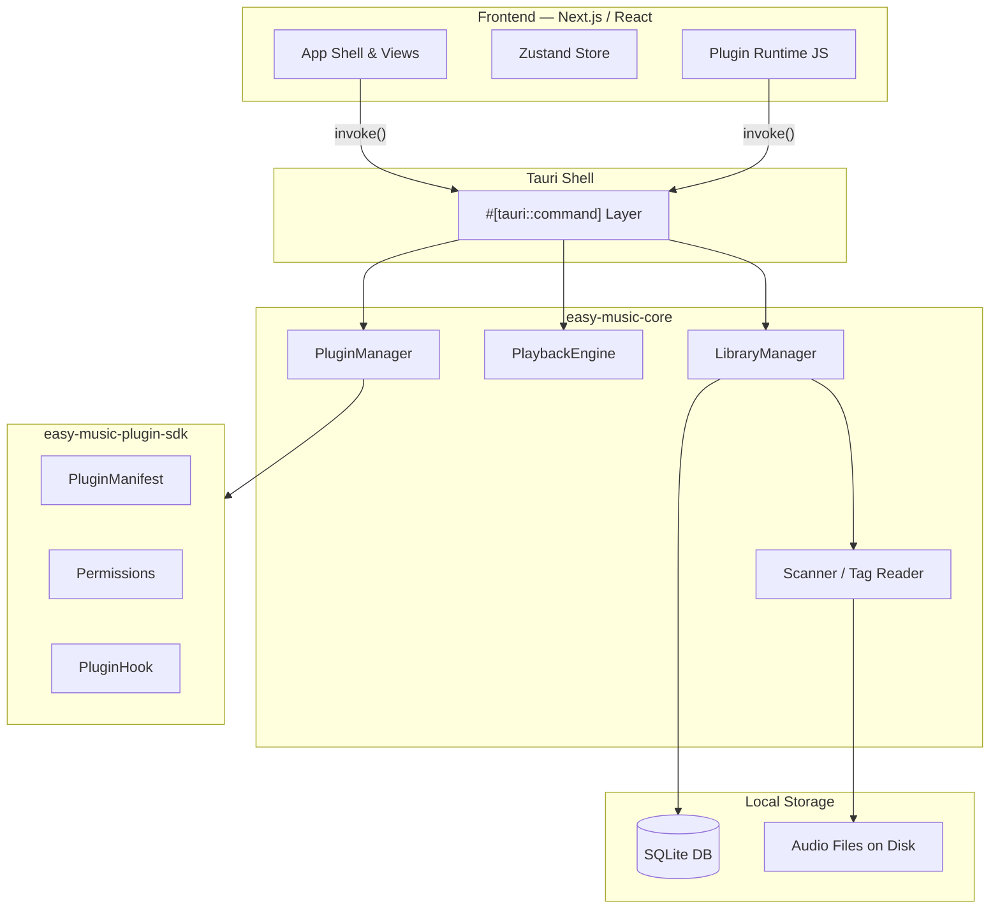
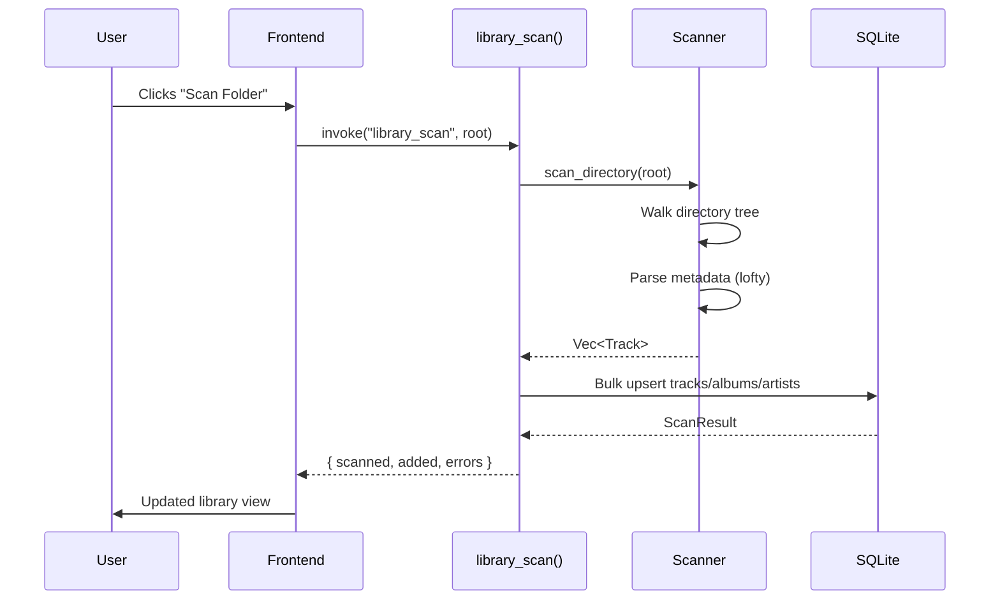
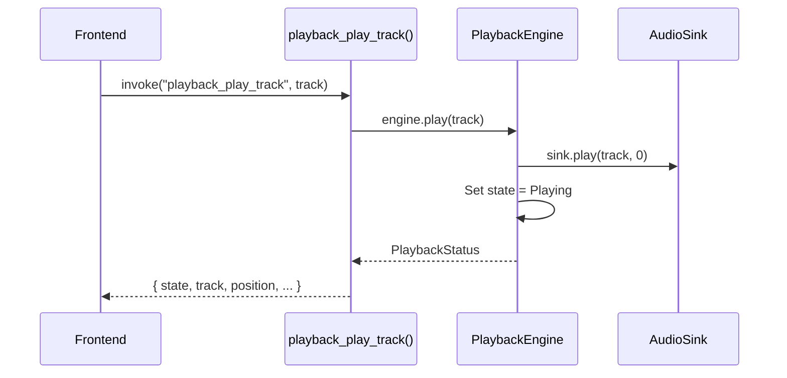
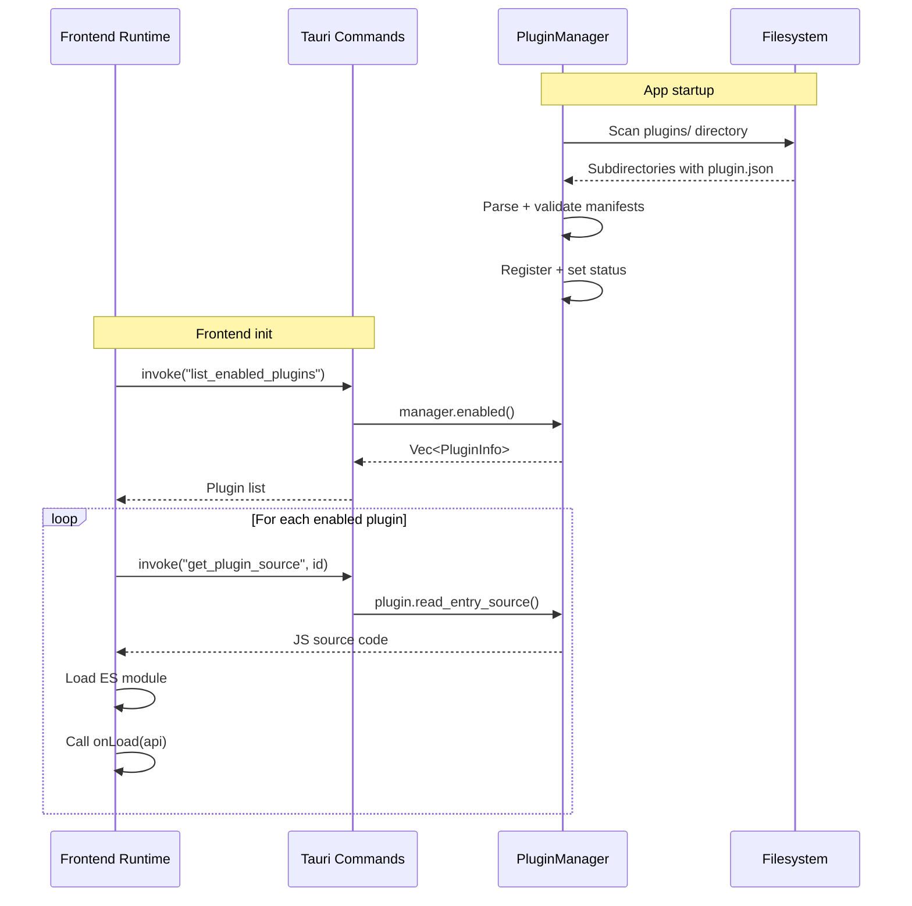
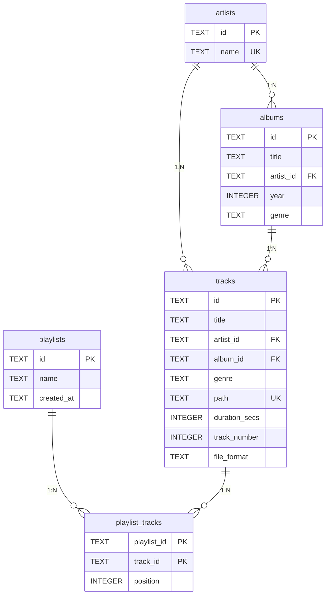
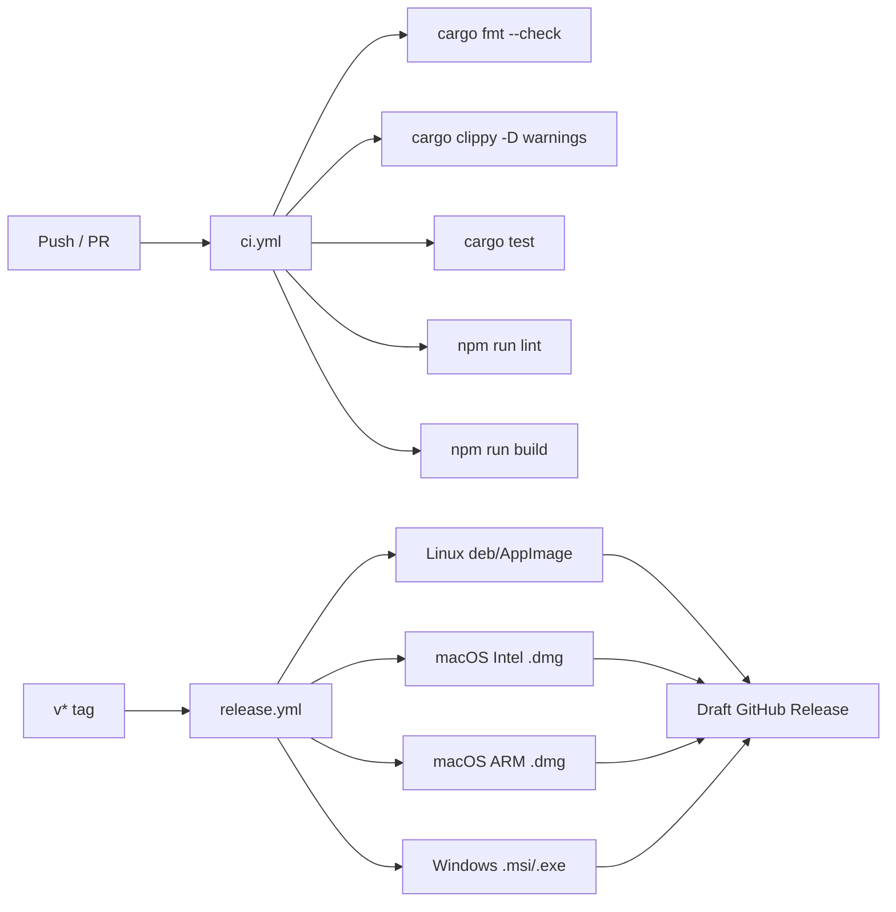

# EasyMusic Architecture

This document describes the high-level architecture of EasyMusic, the major
components, data flow, and key design decisions.

## Overview

EasyMusic is a cross-platform desktop music player built with
[Tauri v2](https://v2.tauri.app/), [Next.js](https://nextjs.org/), and
[Rust](https://www.rust-lang.org/). It is organized as a Cargo workspace with
a Next.js frontend that Tauri bundles into a native desktop application.



## Technology Stack

| Layer         | Technology                                        |
|---------------|---------------------------------------------------|
| Desktop shell | Tauri v2 (Rust, WebView-based, no Electron)       |
| Frontend      | Next.js 16, React 19, TypeScript, Tailwind CSS v4 |
| State         | Zustand                                           |
| Virtualization| @tanstack/react-virtual                           |
| Backend logic | Rust (workspace crates)                           |
| Database      | SQLite (via `rusqlite`, bundled)                  |
| Metadata      | `lofty` (ID3, Vorbis, FLAC, MP4, etc.)            |
| Plugin runtime| JavaScript (in WebView, ES module based)          |

## Crate Structure

### Cargo Workspace

```
src-tauri/                        # Tauri app (binary)
crates/easy-music-core/           # Framework-agnostic core
crates/easy-music-plugin-sdk/     # Plugin SDK (shared types)
```

### easy-music-core

The framework-agnostic heart of the application. Contains all business logic
and is independently testable without Tauri or a GUI.

| Module        | Responsibility                                                        |
|---------------|-----------------------------------------------------------------------|
| `library`     | `LibraryManager` — SQLite-backed track/album/artist/playlist CRUD     |
| `scanner`     | Recursive directory scanner; reads metadata via `lofty`              |
| `playback`    | `PlaybackEngine` — transport state machine, queue, shuffle/repeat     |
| `plugins`     | `PluginManager` — discovers, validates, enables/disables plugins      |
| `db`          | SQLite connection + schema bootstrap                                  |
| `models`      | Serde-serializable data types (`Track`, `Album`, `Playlist`, …)       |
| `error`       | `CoreError` enum + `CoreResult` alias                                 |

### easy-music-plugin-sdk

A dependency-light crate shared between the plugin host and plugin authors.
Contains the manifest schema, permission model, and hook catalog. Parsing is
strict — unknown permissions or hooks are rejected at deserialization time.

### src-tauri

The thin Tauri shell. `#[tauri::command]` functions wrap `easy-music-core`
methods so the frontend can call them via `invoke()`. No business logic lives
here — it is purely a bridge.

## Data Flow

### Library Scan



### Playback



### Plugin Lifecycle



## Database Schema

The library is backed by a SQLite database with the following normalized
schema:



## Supported Audio Formats

The scanner recognizes and parses metadata from:

| Format  | Extension(s)                |
|---------|-----------------------------|
| MP3     | `.mp3`                      |
| FLAC    | `.flac`                     |
| WAV     | `.wav`                      |
| Ogg     | `.ogg`                      |
| AAC/M4A | `.m4a`, `.aac`              |
| Opus    | `.opus`                     |
| WMA     | `.wma`                      |

## Tauri Commands

The frontend communicates with the backend exclusively through Tauri
`invoke()` calls. Key command groups:

| Group     | Commands                                                     |
|-----------|--------------------------------------------------------------|
| Library   | `library_open_db`, `library_scan`, `library_metadata`       |
| Tracks    | `tracks_all`, `track_get`, `tracks_search`, `tracks_filter` |
| Albums    | `albums_all`, `artists_all`                                  |
| Playlists | `playlist_create`, `playlist_rename`, `playlist_delete`, …  |
| Playback  | `playback_play_track`, `playback_pause`, `playback_resume`, …|
| Plugins   | `list_plugins`, `enable_plugin`, `get_plugin_source`, …     |

See `src-tauri/src/commands.rs` and `src-tauri/src/plugin_commands.rs` for the
complete list.

## CI/CD Pipeline



## Further Reading

- [ADR-0001: Plugin System Architecture](adr/0001-plugin-system.md)
- [Plugin Development Guide](plugin-development.md)
- [Contributing Guide](../CONTRIBUTING.md)
